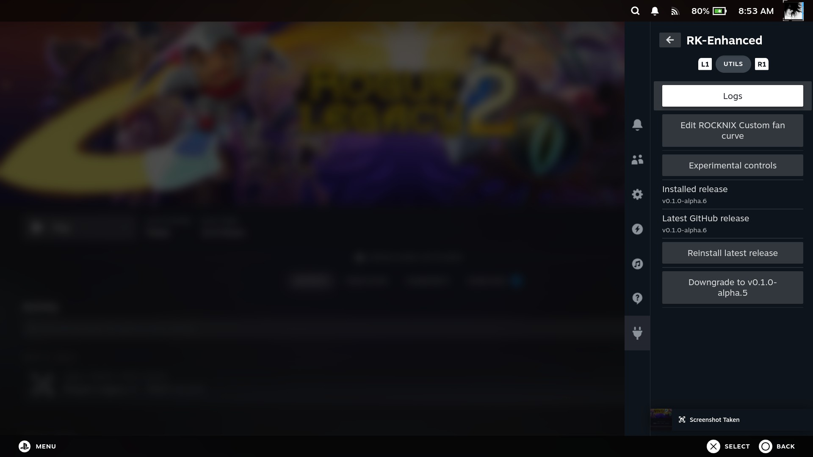
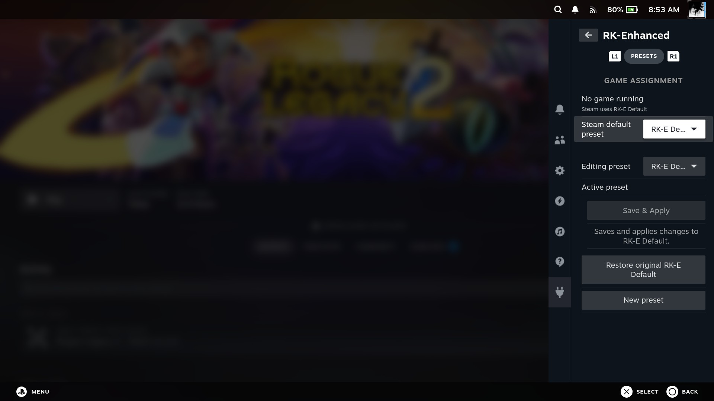
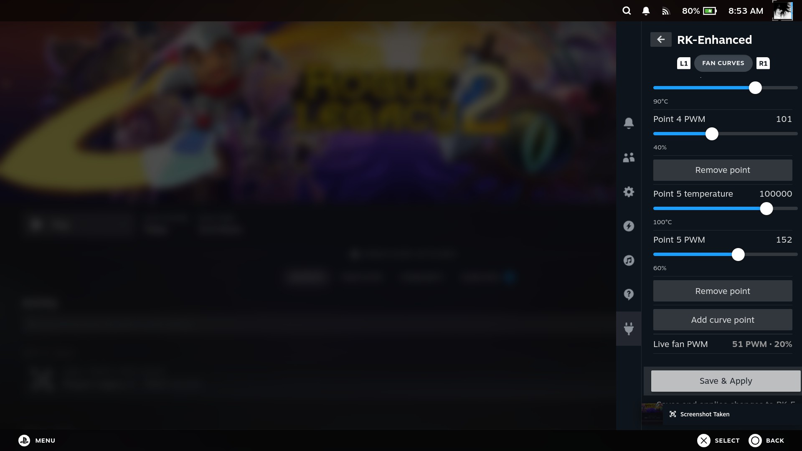
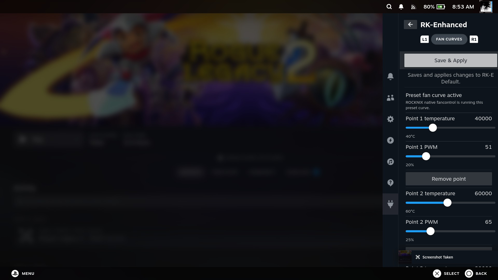
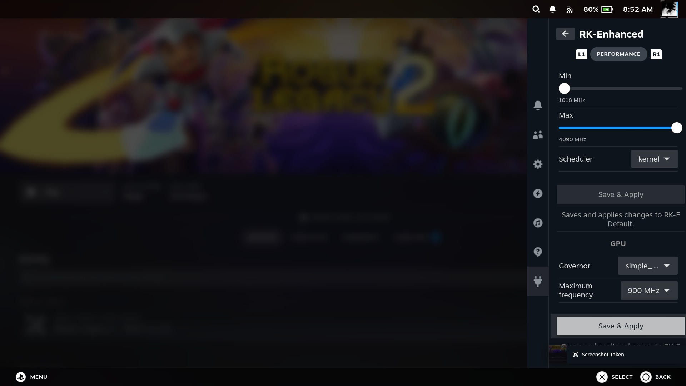
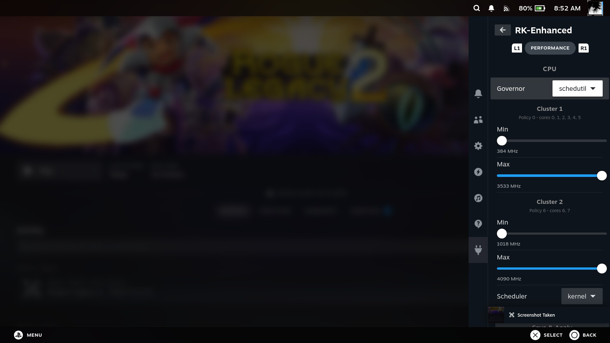
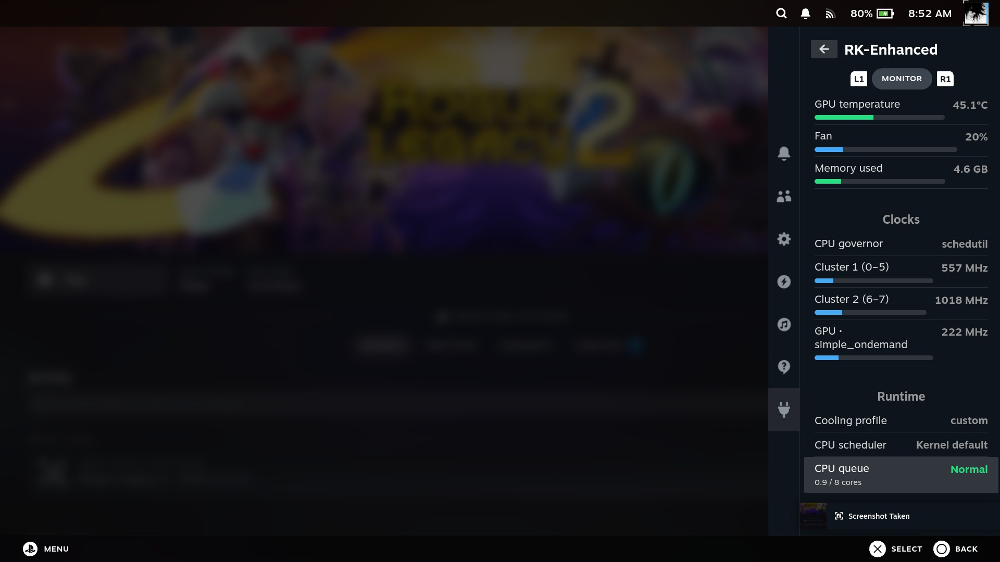
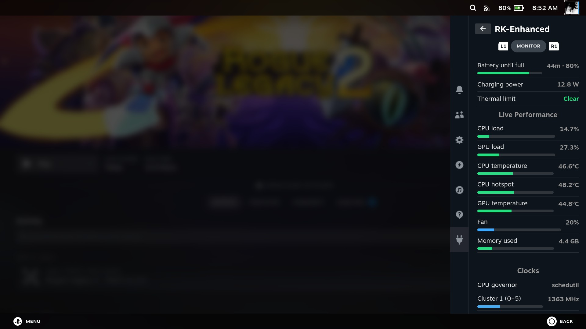

# RK-Enhanced

**RK-Enhanced — ROCKNIX Kontrol Enhanced** is a Decky Loader plugin providing
performance controls, automatic per-game presets, fan-curve management, RGB
lighting controls, and live hardware monitoring for ROCKNIX-based ARM handhelds.

RK-Enhanced is built on the foundation established by Seilent's original
[ROCKNIX Control](https://github.com/seilent/rocknix-control). Its ROCKNIX
integration and Decky control concepts made this project possible.

Detailed changes for each published build are recorded in
[CHANGELOG.md](CHANGELOG.md).

The project later evolved through
[Rocknix-Control-Enhanced](https://github.com/mrdidit/Rocknix-Control-Enhanced/tree/preset-delete-button),
with additional interface concepts and improvements inspired by
[NDC-Enhanced](https://github.com/mrdidit/NDC-Enhanced).

ROCKNIX and NovaDeck expose different services, settings, and hardware
interfaces. RK-Enhanced therefore uses a ROCKNIX-specific backend rather than
directly copying NDC-Enhanced.

> [!WARNING]
> RK-Enhanced is beta software. Hardware controls affect the running system,
> and support can vary between devices and ROCKNIX builds. Keep a recovery
> path available and expect unfinished areas.

## What RK-Enhanced does

### Live monitoring

The Monitor tab provides an at-a-glance view of:

- Stable battery policy, level, and time-estimate rows
- Compact battery flow shown as watts in, watts out, or zero
- CPU and GPU load
- Representative CPU temperature
- CPU hotspot temperature
- GPU temperature
- Fan speed
- Used memory
- Live CPU cluster clocks
- GPU clock and governor
- CPU scheduler
- CPU queue status
- Active thermal limits
- Combined RK-E CPU Load

Temperature and load indicators use severity-based colours so unusual
conditions can be recognised quickly.

The Runtime section reports combined RK-E CPU Load on the same whole-device
scale as Monitor's main CPU load: `100%` means all logical CPU cores are fully
occupied. For example, process CPU equivalent to `60%` of one core is displayed
as `7.5%` on an eight-core device. It combines the RK-Enhanced backend, its
exact child/helper process tree, the PluginLoader lifecycle guard, and the
runtime-restoration guard. Linux's cumulative child counters retain short-lived
helper work after a process exits. Decky/PluginLoader, unrelated plugins, and
native ROCKNIX services are excluded. Per-root process generations prevent
departed or replaced guards from creating false spikes. If an expected guard
cannot be identified exactly, the row reports `Unavailable` rather than a
partial total. The metric reuses Monitor telemetry and creates no additional
polling loop or system-wide process scan.

Battery estimates use smoothed measurements where kernel-provided values are
unreliable. Longer estimates are shortened to forms such as `10h+` to preserve
the Quick Access Menu layout.

### Performance controls

Performance settings can be stored independently in every preset:

- CPU governor
- Minimum and maximum frequency for each CPU cluster
- Device-discovered CPU boost ceilings when ROCKNIX turbo mode is enabled
- GPU governor
- GPU maximum frequency
- Kernel or supported `sched_ext` scheduler

Save & Apply controls are available at convenient points throughout the
Performance tab.

Boost clocks are discovered independently for every CPU policy. They are valid
maximum limits, never minimum choices, and are labelled **Boost** in the UI.
An adaptive governor such as `schedutil` treats the selected value as an upper
limit and requests boost only when needed. The `performance` governor may hold
an allowed boost clock continuously, so RK-Enhanced displays a red warning for
that combination.

### Fan curves

Every RK-E preset contains an independent, editable fan curve.

RK-Enhanced does not run a competing fan-control loop. ROCKNIX's native
`fancontrol.service` continues to control the hardware.

When ROCKNIX cooling is already set to **Custom**, RK-Enhanced:

1. Protects the system ROCKNIX Custom curve.
2. Writes the active RK-E preset curve to `fancontrol.conf`.
3. Reloads native fancontrol.
4. Restores the protected curve when Steam exits or Decky stops unexpectedly.

RK-Enhanced never changes the active ROCKNIX cooling-profile selection.

For RK-E fan curves to operate, configure either:

- **ROCKNIX Settings → Cooling Profile → Custom**, or
- **Per-System Advanced Configuration → Steam → Cooling Profile → Custom**

Steam's **Default** option also works when the System cooling profile is
Custom.

When another cooling profile is active, the Fan Curves tab displays a red
warning and disables its Save & Apply controls. Performance settings remain
available.

### ROCKNIX Custom curve

ROCKNIX provides one native Custom curve through:

```text
/storage/.config/fancontrol.conf
```

RK-Enhanced adds a graphical editor for this curve under:

```text
Fan Curves → Rocknix Fan Curve → Edit custom curve
```

If `fancontrol.conf` does not exist, the editor can create it with a safe initial
curve. The file can then be inspected and modified graphically through
RK-Enhanced; a terminal or external file manager is not required.

Curve configuration and curve activation are deliberately separate. RK-Enhanced
provides the graphical configuration, while the active cooling profile is
selected through ROCKNIX Settings or Steam's Per-System Advanced Configuration.

During first setup, the ROCKNIX Custom curve is copied into **RK-E Default**.
After that initial copy, both curves are completely independent:

- **ROCKNIX Custom** is the protected system curve.
- **RK-E Default** is the standard Steam preset.
- Additional presets each contain their own fan curve.

Editing ROCKNIX Custom does not silently overwrite RK-E Default or other
presets.

### RGB control

On compatible devices, the RGB tab provides graphical control of ROCKNIX's
native stick-ring lighting. Support is discovered from runtime capabilities,
not from a device, product, or SoC allowlist. The tab is omitted when no verified
native interface is available.

Three interface families are supported. Devices with the known native LED-mode
and effect interface retain ROCKNIX's **LED Color** modes:

- Off
- Battery
- RGB

ROCKNIX `ledcontrol` remains the authority for that mode selection. RK-Enhanced
does not replace it, take background ownership of the LEDs, or restore an older
mode when the plugin unloads.

On the Pocket FIT Elite, Battery is ROCKNIX's software battery indication on
the stick rings. The device's separate charging LED remains firmware-controlled.

Devices exposing ROCKNIX's standard analogue-stick capability, executable
public `analog_sticks_ledcontrol` helper, and valid seven-field
`analogsticks.led` state receive an independent static stick-lighting UI. It
provides Stick lighting On/Off, one shared colour, brightness, and optional
colour correction. It does not change `led.color`, so a separate system battery
indicator can continue operating.

If an existing seven-field setting contains different right- and left-ring
colours, RK-Enhanced shows the right-ring colour and warns before saving. An
explicit Save & Apply then makes both rings match. Native-state revisions stop
an older open draft from overwriting a newer ROCKNIX-side edit.

Pocket EVO kernels exposing the complete RGB ABI version 3 receive a dedicated
provider ahead of both existing interfaces. Detection validates the ABI,
attributes, physical zone order, writable controls, and required effects; it
does not rely on a Pocket EVO product or SoC name. An unpatched Pocket EVO-S
with no ABI 3 interface continues using the generic Static provider above and
does not see any ABI 3-only controls. An ABI-looking but incomplete interface
fails closed rather than risking a destructive shared-colour fallback.

The verified FIT stick-ring effect interface offers:

- Static
- Breath
- Rainbow

The FIT and generic providers present the stick rings as one shared lighting
zone. Static mode persists through ROCKNIX's native `analogsticks.led` setting.
RK-Enhanced stores
the chosen source colour, brightness, optional colour correction, and animated
effect so the draft remains coherent across modes. It may reapply a saved
animation at startup only for the verified effect provider while native LED
Color remains RGB. The generic static provider adds no startup write, polling,
restoration, or unadvertised animation command.

Colour correction is off by default and applies only to Static and Breath. When
enabled for a colour containing red, the red channel is unchanged while green
and blue are scaled to 80%. Rainbow is always passed through unchanged.

On the ABI 3 Pocket EVO provider, **Static** remains the default effect. Its
layout editor can address both rings together, the left and right rings, or all
eight physical quadrants while still issuing one complete native Static layout.
The additional native effects are Breath, RGB Breath, Rainbow, and Reactive.
Only controls supported by the selected effect are shown; no unsupported speed
or per-ring animation setting is invented.

Pocket EVO colour calibration is performed by the kernel driver. RK-Enhanced
provides explicit green and blue percentage controls plus Reset (`15 20`) and
Raw (`100 100`) actions, and never layers the older 80% software correction on
top. A saved calibration override may be restored once after boot. Lighting
layouts, effects, and the user's Off state are never taken into background
ownership or automatically restored.

The Pocket EVO driver remains the sole owner of the RGB controller UART.
RK-Enhanced neither opens the UART nor invokes `ledcontrol` for ABI 3 effects.
It submits each command as one complete sysfs write and verifies native cached
readback. Failed operations are followed by a complete native refresh; if an
applied value could not be persisted, it remains visible as unsaved instead of
being presented as committed. Dormant ABI 3 preferences are retained if a
kernel without the EVO patch temporarily falls back to generic Static control.
A genuinely mixed eight-zone Static layout can take roughly four seconds to
apply, so work remains serialized in the backend and off the UI thread.
ROCKNIX's temporary `enabled` suspend gate is displayed but never claimed as
RK-Enhanced's persistent On/Off control.

### Presets and automatic game switching

The preset system contains:

- **RK-E Default**
- Additional named presets

A new preset copies the complete currently selected preset, including:

- CPU configuration
- GPU configuration
- Scheduler
- Fan curve

Any preset can be selected as the Steam default.

While a game is running, the Presets tab provides a dedicated **Game preset**
dropdown. Selecting an entry assigns and immediately applies that preset.

A lightweight backend watcher monitors Steam independently of the Decky panel:

```text
Steam idle
    ↓
RK-E Default or selected Steam default
    ↓
Game starts
    ↓
Assigned game preset
    ↓
Game exits
    ↓
Steam default restored
```

The watcher reads the small Steam systemd process scope, avoids global process
scanning, and debounces launch and exit transitions. Preset switching therefore
continues while the RK-Enhanced panel is closed.

### Utilities

The Utils tab contains:

- Current device IPv4 address and network interface
- Combined runtime and installer logs
- Installed and latest release discovery
- Update to the latest published release
- Reinstall the current release
- Install the previous published release, clearly identified as release history
  rather than local installation history
- Restore the last installed release when trustworthy local history is available
- Clean ordinary old RK-Enhanced rollback backups while retaining the newest
- Hidden experimental controls

Release discovery includes GitHub pre-releases.

An update, reinstall, downgrade, or last-installed restore opens a blocking
transaction view with real phases: download, validation, backup, installation,
Decky reload, verification, and either completion or rollback. It does not
display a fabricated percentage.
RK-Enhanced mutations remain disabled while the transaction is active. Progress
is stored outside the plugin directory, so the same transaction returns after
Decky reloads or Quick Access is reopened. Every phase is also appended to the
rotated installer journal shown by Utils → Logs.

**Previous published release** means the release immediately before the
installed version on GitHub; it may not have been installed on this device.
**Last installed release** is shown separately only when a completed local
cross-version transaction recorded it and it is not already the same release as
the previous-published option.

**Clean old RK-E backups** only considers real, immediate
`RK-Enhanced-before-*` directories under
`/storage/homebrew/plugin-backups`. It keeps the newest ordinary snapshot and
never follows symlinks or removes install/update recovery artifacts, unknown
directories, other plugins' backups, or Decky's active Loader rollback file.

Updates are installed by a detached updater that:

1. Downloads and validates the selected RK-Enhanced release and the newest
   published Decky Loader, including compatibility prereleases.
2. Creates unique rollback copies of both installed components and their
   version metadata.
3. Replaces RK-Enhanced and Decky as one serialized transaction.
4. Reloads Decky and verifies the exact backend and frontend generation before
   recording success.
5. Rolls both components back if validation fails.
6. Does not terminate Steam or running game processes. After an intentional
   maintenance reload, Steam may still leave a running game waiting on its
   Resume screen; automatic foreground restoration is reserved for automatic
   crash recovery.

### Conflicting ROCKNIX Control installations

The original ROCKNIX Control and Rocknix Control Enhanced use the same plugin
manifest identity, **ROCKNIX Control**. Both can independently write CPU, GPU,
and fan settings, so running either beside RK-Enhanced can create ownership
races.

The full SSH installer scans only immediate plugin directories and matches that
exact normalized manifest identity. It blocks by default when a conflict is
found. To explicitly remove the conflicting plugin directory without creating
a plugin backup, then continue installation, use:

```sh
curl -fL https://raw.githubusercontent.com/mrdidit/RK-Enhanced/main/install.sh | \
  sh -s -- --remove-conflicting-rocknix-control
```

The removal is permanent for the plugin files, but leaves that plugin's settings
untouched. The installer stops only `plugin_loader.service`, revalidates the
exact non-symlink plugin directory and manifest, removes it, restores native
`fancontrol.service`, and then continues. Detection, removal, fancontrol
restoration, and the final result are recorded in the installer journal.

RK-Enhanced also checks this identity at runtime. If ROCKNIX Control is installed
later, RK-Enhanced blocks preset and hardware mutations while leaving Monitor,
Logs, Utils, and the removal action available. A release installed from an older
RK-Enhanced updater cannot gain the new pre-install UI retroactively; the new
runtime guard takes effect as soon as that release loads. Use the full SSH
installer when the conflict must be handled before replacement begins.

UI-initiated installs require a nonce-bound response from the exact backend and
from the exact frontend bundle after Decky evaluates and registers that bundle
and it completes a successful `getState()` round trip. This startup proof is
independent of whether Quick Access or the RK-Enhanced panel is open. It proves
bundle execution and backend communication, not that a particular panel is
currently visible. A full SSH install applies the same frontend proof whenever
Steam Big Picture is active. When Steam Big Picture is inactive, it reports
that only the backend was verified and the frontend was not tested, rather than
implying a deferred check. The check also binds release version, boot ID,
live process start times, backend hash, bundle hash, and the bundle's
independently verified self-integrity ID. Neither path records the new installed
version merely because the systemd unit became active.

Installer and updater shutdown is bounded and scoped to
`plugin_loader.service`: they request a non-blocking stop, wait up to 15
seconds, then allow at most three seconds each for unit-cgroup `SIGTERM` and
`SIGKILL` escalation. They never kill processes globally by the names
PluginLoader, FEX, or Python.

Before an intentional stop, maintenance takes the lifecycle helper's exact
fixed lock (`/run/lock/rk-enhanced-plugin-loader-recovery.lock`) and creates its
fixed marker (`/run/rk-enhanced-plugin-loader-recovery.active`). The lock is
held across stop, file replacement, and the tentative service start. It is then
released so the new backend can publish its lifecycle generation. A separate
install-transaction lock remains held throughout readiness verification and
rollback, preventing overlapping installs while allowing normal lifecycle
publication. The marker is removed on both success and failure.

Rollback reacquires the lifecycle lock before stopping or changing anything.
The previous plugin, Decky executable, service/version metadata, and active
state are restored together. Protocol-aware releases must prove their restored
backend generation; older releases are explicitly reported as legacy and
unverified. If safe rollback cannot obtain the lock or finish, persistent
recovery files are retained under `/storage/homebrew/plugin-backups`.

Downgrading preserves the safer current updater so reinstalling a newer release
cannot restore obsolete Steam lifecycle behaviour.

Downgrades are intended for recovery only. Releases predating the public
charging-helper boundary may directly write, capture, or restore charging state.
Before downgrading, use the current Experimental tab to select Battery policy
Normal and Pump profile Qcom Normal, confirm both fresh statuses, then hide
the experimental controls. Reboot immediately after the downgrade before using
charging controls. Preserving the current updater makes it possible to return
to a newer release, but does not make an older plugin's charging behaviour safe.

### Experimental charging controls

Charging controls are currently hidden behind the experimental unlock in Utils.
They are intended only for compatible devices whose ROCKNIX build provides the
canonical native charging helpers and required runtime capabilities. Unlocking
the Experimental tab does not add charging support to incompatible hardware.
On supported KPFE builds, the tab provides two independent control families:

- Battery policy: Normal, Bypass, or Limit 50–100%
- Pump profile: Qcom Normal, Slow 25 W, or Fast 36 W

**Limit 100%** stops charging at 100% and resumes at 95%. The five-point gap is
intentional hysteresis, preventing repeated stop/start cycling at the endpoint.

RK-Enhanced never writes charging sysfs controls directly. Battery policy is
owned exclusively through `/usr/bin/charging_mode`, and the dual-pump profile is
owned exclusively through `/usr/bin/kpfe_fast_charge`. Slow and Fast require a
new risk confirmation for every enable request.

On newer compatible helpers, Experimental Status also reports **USB input
power** from the optional atomic status fields returned by
`/usr/bin/kpfe_fast_charge status`. Qualcomm and dual-pump measurements are
shown as wattage only; Offline and Transitioning are shown
without a fabricated zero. Missing, malformed, stale, unavailable, or
incoherent telemetry shows Unavailable or Stale and never retains an earlier
wattage. This is charging-path input power, distinct from Monitor's
battery-derived **Battery charge power**. RK-Enhanced does not probe USB or pump
sysfs as a fallback.

The same serialized status refresh reads the generic
`/sys/class/power_supply/battery/temp` attribute once and shows **Battery
temperature** in degrees Celsius. Missing or malformed samples show Unavailable.
Temperature colours are green below 35°C, yellow from 35°C, orange from 45°C,
and red from 50°C; sub-zero readings are also red. These conservative bands are
informational and do not replace the helper or coordinator safety limits.

Experimental Status uses semantic colours for quick recognition: healthy or
active states are green, inactive states are blue, transitions and unknown
states are yellow or orange, and errors are red. **Battery charging** reports
whether charging is Allowed or Paused; it does not claim that current is flowing.

The Limit 100 hysteresis explanation is shown only while Limit 100 is selected.
Both selectors remain locked until a current, coherent status refresh succeeds.
Either selector is disabled when either helper status is invalid, stale, or
transitional. Hiding the tab, unloading RK-Enhanced, or crashing Decky does not
issue a charging command or restore an earlier charging mode; the canonical
ROCKNIX helpers and coordinator own that lifecycle.

Bypass behaviour still depends on the device and power supply. Sufficient power
may hold the battery level, while a weaker source can allow partial discharge or
continued slow charging.

## Hardware support

Development and live testing currently focus on Qualcomm-based ROCKNIX
handhelds, including:

- Snapdragon SM8650
- Snapdragon SM8750

RK-Enhanced discovers CPU policies, GPU interfaces, thermal zones, fan controls,
RGB lighting, and battery features at runtime. Controls unavailable on a device
should be omitted or reported as unavailable.

Broader hardware validation is still required.

## GPU monitoring

On Qualcomm/Adreno devices exposing KGSL, RK-Enhanced reads:

```text
/sys/class/kgsl/kgsl-3d0/gpu_busy_percentage
```

This provides system-wide GPU activity and closely follows the value used by
MangoApp.

When KGSL activity is unavailable, RK-Enhanced can fall back to DRM client
engine accounting associated with the active Steam application or gamescope.
Process and file-descriptor discovery is cached to avoid expensive repeated
scans.

## Temperature monitoring

Thermal-zone discovery is designed to work across different Qualcomm layouts.

Current representation:

- **CPU temperature:** average of available CPU package sensors
- **CPU hotspot:** hottest valid CPU or CPU-package sensor
- **GPU temperature:** primary GPU package sensor, with a fallback to the
  hottest GPU sensor

Colour thresholds:

- Green: below 50°C
- Yellow: 50–69°C
- Orange: 70–84°C
- Red: 85°C and above

The representative CPU value is intended to describe overall package
conditions, while CPU hotspot highlights the hottest observed area.

## Design challenges

### ROCKNIX has one Custom fan slot

ROCKNIX always reads the same `fancontrol.conf` file. Multiple RK-E curves
therefore require controlled temporary replacement rather than separate native
fan slots. The restoration guard exists to keep this process recoverable.

### ROCKNIX cooling overrides are global

An explicit Steam cooling override can be copied into the global ROCKNIX
setting. After Steam exits, ROCKNIX may leave that value active instead of
restoring the earlier System profile.

For example:

```text
System: Quiet
Steam: Aggressive
```

may leave the System profile at Aggressive afterward. RK-Enhanced deliberately
does not alter or restore ROCKNIX profile selections.

### Decky runs through FEX

On the tested ARM ROCKNIX environment, Decky and plugin workers run through
FEX. This introduces several complications:

- System tools can inherit incompatible private libraries.
- Graceful PluginLoader shutdown can occasionally hang.
- Old child processes may survive a failed restart.
- Frontend bundles must be classic scripts rather than ES modules.

RK-Enhanced sanitises child-process library variables and emits its frontend as
an IIFE bundle to remain compatible with this environment.

### Hardware interfaces vary

Thermal names, CPU clusters, GPU drivers, battery controls, fan paths, and
writable sysfs entries can differ between devices and ROCKNIX versions.
Runtime discovery reduces hard-coded assumptions, but cannot replace testing
across real hardware.

### Monitoring must remain lightweight

Telemetry polling can itself affect performance if implemented carelessly.
RK-Enhanced caches expensive discovery, avoids duplicate pollers, starts
Monitor polling only while Quick Access is open on the Monitor tab, and
serializes those requests. Experimental status polling likewise stops when its
tab or Quick Access is hidden. Each response is bound to the current Monitor
activation and charging revision, so late results are discarded after a panel
close, tab change, or status failure.

RGB does not add a polling loop. Its current state is read on visible tab
activation and after an explicit change; it performs no recurring read or write.

The automatic game watcher reads only Steam's small process cgroup rather than
repeatedly scanning the whole system.

### Runtime restoration

Before the first preset is applied in a Steam session, RK-Enhanced captures the
native CPU, GPU, and scheduler state. It records only controls RKE
actually changes and restores their native values when Steam exits, the plugin
unloads, or Decky/plugin workers terminate unexpectedly.

Clean unload writes a one-shot restore request for the already-independent
session guard before attempting an immediate detached restore. The request
remains authoritative if that faster launch fails, so restoration does not
depend on Decky terminating the old backend process promptly.

Restoration is ownership-aware: a value is restored only while it still equals
the last value written by RK-Enhanced. If ROCKNIX or another tool changes that
control afterward, RK-Enhanced leaves the newer value intact. Runtime values
are not carried across a reboot; the protected persistent ROCKNIX Custom fan
curve is still recovered when necessary.

### PluginLoader lifecycle recovery

RK-Enhanced also starts `plugin_loader_recovery.py` as a transient systemd
guard outside `plugin_loader.service`. This is a general runtime watchdog for
the active Decky/RK-Enhanced generation. It is not an updater retry mechanism
and does not reinterpret a download, installation, or rollback failure as a
runtime crash.

Each guard receives an immutable same-boot lease with a random token and exact
identities for both the RK-Enhanced backend and PluginLoader. An identity is the
numeric PID plus its `/proc` start-time ticks; the start time prevents a reused
PID from being mistaken for the generation that was originally observed. The
guard additionally verifies the fixed PluginLoader binary, systemd unit, and
control group before recovery.

The backend maintains an active marker and a same-boot monotonic heartbeat. A
new guard must validate its immutable lease and publish a readiness marker
before the backend makes that generation current; an older guard accepts the
handoff only while the new owner, Loader, readiness, and heartbeat all remain
valid. Clean unload removes the active marker before other cleanup, so an
intentional Decky stop exits without recovery. For a genuine failure, cleanup
is limited to the captured old owner tree and every PID/start-time identity is
revalidated immediately before a bounded signal; there is no global FEX or
Python kill.

Automatic PluginLoader restart is deferred unless Steam Big Picture is active.
A same-boot 120-second cooldown permits at most one automatic recovery attempt
inside that window, preventing a persistent failure from becoming a restart
loop.

If an automatic recovery occurs while a game is running, the guard records a
short-lived, same-boot AppID request before Decky reloads. The replacement
RK-Enhanced frontend consumes that request once, verifies that the same AppID
is still running, waits for Steam's rebuilt UI to recognise it, then selects
that AppID and navigates through Steam's gamescope Resume path. This does not
launch or relaunch a game. Missing, expired, changed, or malformed requests do
nothing. Manual Decky restarts, installs, updates, and Utils actions never create
the request.

## Current limitations

- Hardware coverage remains limited.
- Qualcomm KGSL and MSM DRM receive the strongest GPU-monitoring support.
- Thermal sensor naming may require additional device-specific handling.
- The Fan Curves tab can create `/storage/.config/fancontrol.conf` when it is
  missing and graphically edit the ROCKNIX Custom curve afterward. Activation
  still occurs through ROCKNIX or Steam cooling-profile settings.
- Native ROCKNIX profile overrides may remain active after Steam exits.
- Crash recovery and ownership-aware restoration need broader long-duration
  testing across devices.
- Touch, controller navigation, and compact-screen layouts still need
  refinement.
- Experimental charging controls are compatible-device-only and are not ready
  for general exposure.
- RGB controls are hidden unless either a verified native mode/effect interface
  or the complete generic analogue-stick interface is present. Animated effects
  still require the known stick-ring effect interface.
- Preset import, export, and sharing are not yet available.
- TDP control is not currently implemented.

## Roadmap

### Beta stabilisation

- Stress-test launch, exit, crash, sleep, resume, and reboot transitions
- Validate restoration after forced PluginLoader termination
- Expand SM8650 and SM8750 device testing
- Improve detection of unsupported and partially supported controls
- Add clearer diagnostics when sysfs writes fail
- Refine controller and touch navigation
- Reduce remaining layout inconsistencies
- Review every preset migration path

### Hardware expansion

- Add more Qualcomm GPU layouts
- Improve non-KGSL GPU monitoring
- Build a reusable device-capability registry
- Validate additional battery and charging interfaces
- Improve thermal-zone classification
- Investigate safe power and TDP controls where hardware support exists

### Preset improvements

- Import and export presets
- Duplicate presets explicitly
- Display the effective preset and reason for selection
- Add assignment summaries
- Add optional preset reset points
- Improve conflict handling when settings change outside RK-Enhanced

### Diagnostics and recovery

- Export a compact diagnostic report
- Include device, ROCKNIX build, sensor discovery, and recent logs
- Add restoration self-tests
- Detect stale configuration sessions at boot
- Improve recovery guidance when Decky or Steam becomes unavailable

### Longer-term direction

- Broader ARM handheld support
- More device-specific safeguards
- Optional performance recommendations based on detected capabilities
- Stable preset schema with backward-compatible migrations
- A polished 1.0 release after sufficient hardware coverage and recovery
  testing

## Installation

Run the installer as `root` on the ROCKNIX device:

```sh
curl -fL https://raw.githubusercontent.com/mrdidit/RK-Enhanced/main/install.sh | sh
```

The installer retrieves the latest published RK-Enhanced release and Decky
Loader, including prereleases. Decky prereleases are included because current
Steam builds can require compatibility fixes not yet present in Decky's latest
stable build. Review `install.sh` before piping it into a shell.

When moving from beta.9 or earlier to beta.10, run the full installer above
once. An in-plugin update is started by the updater from the currently
installed release, so the older updater does not yet use beta.10's
prerelease-aware Decky selection before replacement begins. If the selected
Loader is incompatible, readiness verification rejects it and restores the
previous installation instead of recording a false success.

After beta.10 is installed, future Update, Reinstall, and Downgrade actions use
the corrected Decky selection automatically. Frontend readiness is verified
without requiring Quick Access or the RK-Enhanced panel to be open. The legacy
visibility-hook fallback remains in place so an older Loader cannot prevent
RK-Enhanced from rendering during this transition.

Manual layout:

```text
/storage/homebrew/plugins/RK-Enhanced/
├── dist/index.js
├── dist/frontend-integrity.json
├── charging.py
├── install-health.json
├── main.py
├── plugin_loader_recovery.py
├── rgb.py
├── runtime-restore.py
├── runtime-restore-guard.sh
├── updater.sh
└── plugin.json
```

## Development

Requirements:

- Node.js
- pnpm
- Python 3

Validation and build:

```sh
pnpm install
python3 -m py_compile main.py charging.py rgb.py runtime-restore.py plugin_loader_recovery.py
python3 -m unittest discover -s tests -v
pnpm typecheck
pnpm test:rgb-model
pnpm build
pnpm verify:frontend
```

The frontend is emitted as an IIFE because the tested Decky/FEX environment
evaluates plugin bundles as classic scripts. An ESM bundle fails with:

```text
Unexpected token: export
```

## Reporting problems

Useful reports include:

- Device model and SoC
- ROCKNIX build
- RK-Enhanced version
- Exact reproduction steps
- Expected and observed behaviour
- Relevant output from Utils → Logs

## Origins and acknowledgements

RK-Enhanced would not exist without **Seilent's original
[ROCKNIX Control](https://github.com/seilent/rocknix-control)**.

That project established the core idea of bringing ROCKNIX hardware controls
into Decky's Quick Access Menu and provided the foundation from which
Rocknix-Control-Enhanced and RK-Enhanced developed.

Further development draws from:

- [ROCKNIX Control](https://github.com/seilent/rocknix-control) by Seilent — the
  original foundation
- [Rocknix-Control-Enhanced](https://github.com/mrdidit/Rocknix-Control-Enhanced/tree/preset-delete-button)
  — the earlier enhanced fork
- [NDC-Enhanced](https://github.com/mrdidit/NDC-Enhanced) — interface and
  workflow inspiration
- The ROCKNIX project and its device-specific services, quirks, and hardware
  support

RK-Enhanced continues that work with deep respect for the projects and
contributors that made it possible.

## Development collaboration

RK-Enhanced is developed through hands-on hardware testing, direct ROCKNIX
inspection, and iterative coding collaboration with **Codex**.

Development has used **GPT-5.6 Sol**, with reasoning effort scaled from
**Light through Ultra** according to task complexity. Hardware behaviour and
final decisions are validated against real devices rather than accepted from
generated output alone.

## License

MIT

## Screenshots

### Utils



### Presets



### Fan curves and live fan output



### Fan-curve editor



### GPU performance controls



### CPU performance controls



### Monitor clocks and runtime



### Live performance monitor


